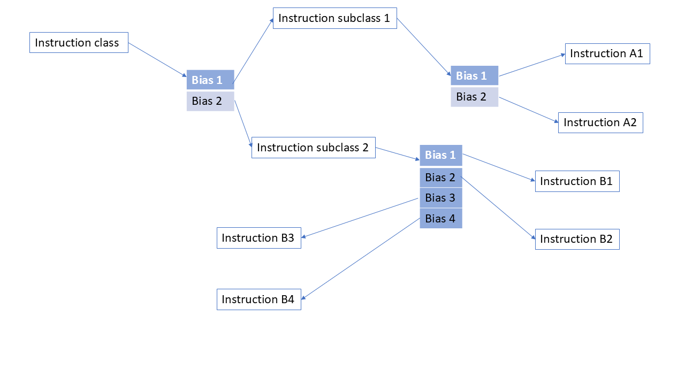

Overview of Bias Tree
=========================

The bias tree functions as a mechanism to randomly determine the order
of SMC calls directed to TF-A. Here is an example.

|Bias Tree Example|
*Figure 2: Bias Tree Example*

Each SMC call is categorized as in a feature list(i. e. SDEI, TSP...etc)
and then could be subcategorized into smaller lists relevant to testing
strategy. This grouping allows a user to assert control over which flavors
of SMC calls are executed within a given test scenario. In this example
we have feature sets corresponding to the different areas of TF-A that
can be biased or turned off altogether. This permits very focused testing
to very general by altering the bias numbers contained in the tree.

Here is a generalized example bias tree:

.. code-block:: devicetree

    svc_var1 {
	bias = <65>;
	svc_var1_var1 {
	    bias = <30>;
	    functionname = "svc_var1_var1";
	};
	smc_var1_var2 {
	    bias = <30>;
	    functionname = "smc_var1_var2";
	};
	smc_var1_var3 {
	    bias = <35>;
	    smc_var1_var3_var1 {
		bias = <30>;
		functionname = "smc_var1_var3_var1";
	    };
	    smc_var1_var3_var2 {
		bias = <30>;
		functionname = "smc_var1_var3_var2";
	    };
	    smc_var1_var3_var3 {
		bias = <40>;
		functionname = "smc_var1_var3_var3";
	    };
	    smc_var1_var3_var4 {
		bias = <55>;
		smc_var1_var3_var4_var1 {
		    bias = <89>;
		    functionname = "smc_var1_var3_var4_var1";
		};
		smc_var1_var3_var4_var2 {
		    bias = <95>;
		    functionname = "smc_var1_var3_var4_var2";
		};
		smc_var1_var3_var4_var3 {
		    bias = <35>;
		    smc_var1_var3_var4_var3_var1 {
			bias = <30>;
			functionname = "smc_var1_var3_var4_var3_var1";
		    };
		    smc_var1_var3_var4_var3_var2 {
			bias = <30>;
			functionname = "smc_var1_var3_var4_var3_var2";
		    };
		    smc_var1_var3_var4_var3_var3 {
			bias = <40>;
			functionname = "smc_var1_var3_var4_var3_var3";
		    };
		    smc_var1_var3_var4_var3_var4 {
			bias = <55>;
			smc_var1_var3_var4_var3_var4_var1 {
			    bias = <89>;
			    functionname = "smc_var1_var3_var4_var3_var4_var1";
			};
			smc_var1_var3_var4_var3_var4_var2 {
			    bias = <95>;
			    functionname = "smc_var1_var3_var4_var3_var4_var2";
			};
		    };
		};
	    };
	};
	smc_var1_var4 {
	    bias = <35>;
	    smc_var1_var4_var1 {
		bias = <30>;
		functionname = "smc_var1_var4_var1";
	    };
	    smc_var1_var4_var2 {
		bias = <30>;
		functionname = "smc_var1_var4_var2";
	    };
	    smc_var1_var4_var3 {
		bias = <40>;
		functionname = "smc_var1_var4_var3";
	    };
	};
    };
    smc_var2 {
	bias = <35>;
	smc_var2_var1 {
	    bias = <30>;
	    functionname = "smc_var2_var1";
	};
	smc_var2_var2 {
	    bias = <30>;
	    functionname = "smc_var2_var2";
	};
	smc_var2_var3 {
	    bias = <40>;
	    functionname = "smc_var2_var3";
	};
    };
    smc_var3 {
	bias = <55>;
	smc_var3_var1 {
	    bias = <30>;
	    functionname = "smc_var3_var1";
	};
	smc_var3_var2 {
	    bias = <30>;
	    functionname = "smc_var3_var2";
	};
	smc_var3_var3 {
	    bias = <40>;
	    functionname = "smc_var3_var3";
	};
    };

The number of levels of hierachy can be unlimited. A specific
example that is relevant to TF-A(SDEI) is:

.. code-block:: devicetree

    sdei {
	bias = <30>;
	sdei_version {
	    bias = <30>;
	    functionname = "sdei_version";
	};
	sdei_pe_unmask {
	    bias = <30>;
	    functionname = "sdei_pe_unmask";
	};
	sdei_pe_mask {
	    bias = <30>;
	    functionname = "sdei_pe_mask";
	};
	sdei_event_status {
	    bias = <30>;
	    functionname = "sdei_event_status";
	};
	sdei_event_signal {
	    bias = <30>;
	    functionname = "sdei_event_signal";
	};
	sdei_private_reset {
	    bias = <30>;
	    functionname = "sdei_private_reset";
	};
	sdei_shared_reset {
	    bias = <30>;
	    functionname = "sdei_shared_reset";
	};
    };

Here we see a single level of hierarchy where all the
flavors of SDEI calls have an equal chance of being selected.
To incorporate additional calls of another feature set we
could add another level and then bias each as separate
branches. Here is an example for adding TSP based calls:

.. code-block:: devicetree

	sdei {
		bias = <30>;
		sdei_version {
			bias = <30>;
			functionname = "sdei_version_funcid";
		};
		sdei_pe_unmask {
			bias = <30>;
			functionname = "sdei_pe_unmask_funcid";
		};
		sdei_pe_mask {
			bias = <30>;
			functionname = "sdei_pe_mask_funcid";
		};
		sdei_event_status {
			bias = <30>;
			functionname = "sdei_event_status_funcid";
		};
		sdei_event_signal {
			bias = <30>;
			functionname = "sdei_event_signal_funcid";
		};
		sdei_private_reset {
			bias = <30>;
			functionname = "sdei_private_reset_funcid";
		};
		sdei_shared_reset {
			bias = <30>;
			functionname = "sdei_shared_reset_funcid";
		};
	};
	tsp {
		bias = <30>;
		tsp_add_op {
			bias = <30>;
			functionname = "tsp_add_op_funcid";
		};
		tsp_sub_op {
			bias = <30>;
			functionname = "tsp_sub_op_funcid";
		};
		tsp_mul_op {
			bias = <30>;
			functionname = "tsp_mul_op_funcid";
		};
		tsp_div_op {
			bias = <30>;
			functionname = "tsp_div_op_funcid";
		};
	};

Either TSP or SDEI biases could be set to zero for no selection
or blended together with a desired emphasis of one over the other.
Also further fine grained tuning could be applied to each with
specific biases specified to the SMC calls themselves. This is
ideal for various maturity levels of the code base where features
and/or calls can be controlled over the course of a software
project.

Detailed description of the Nodes in the Bias Tree
====================================================

Each node in the tree represents a point where the fuzzer engine
randomly selects a given path based on the biases given. The
absolute values given are not meaningful but only in the context of
relative weights against the other biases in the node. For example,
a bias node with two options could have relative biases of 1:1, 20:20,
50:50 and the same effect on the path is implied - there would be an
even chance either option is selected (although there is greater
efficiency with lower numbers for fuzz performance). It is suggested
to keep the numbers as low as possible for each node.

When adding new instructions it would be ideal to classify them in some
meaningful way so they can be optimally positioned in the tree to
facilitate testing of various types of scenarios. For instance, if there
is a set of instructions that are performance intensive or can cause
undefined behavior there may be a justification to reduce or eliminate
them in a particular run or perhaps instead to emphasize their selection
to enhance bug finding. Another approach might be to favor a certain
generalized type of testing such as SDEI or world switching of various types.
It should be noted that the instructions do not have to be SMC calls only
but can be groups of SMC or some other form of granularity that could be
useful but should work in a generalized context as much as possible.

More nodes and branches provides more flexibility in testing as a general rule.
As an additional note of usage more bias tree types can be stored where each
gives a preference for testing in a certain domain. However for bug finding
especially in CI it will be useful to have a large tree to mix as many scenarios
as possible.  A "top" tree would be used for this purpose. It is probably in
the best interest for QA for the introducer to add to the top level tree in
some way for inclusion into CI runs where they can decide on frequency of
execution(as well as the categories they fall under). The first step would
be to graft to this tree with the appropriate biases with sub class designations
where each instruction would be assigned a uniquified string. Next, a header
file would be created in the fuzzing include directory where the string
identification would take place and then a subsequent execution of the SMC
call(s) would occur.

Adding Fuzzing arguments to the SMC Call
=========================================

The above description will serve to provide a means to add the SMC calls but
only covers the call itself without reference to the input arguments. This next
section will detail how to add the arguments/fields to the call and also to give
the developer the means to control how those fields are derived in the fuzzing
process.  Before giving the steps it is necessary to explain how the fuzzer
views the arguments from what is called differing sanity levels.

The sanity level is a top level designation of how the arguments are randomized
for a given test. The higher the sanity the more constraints are applied to the
arguments. There are four levels(0 - 3) and each is described below:

Sanity level 0:

Here all the input register inputs are fully randomized without reference to field
sizes or obeying any given constraints. This would mean that a 64 bit register
has a full 64 bit random value across all input arguments even those that would be
specified as reserved. The purpose is to find any hangs or assert fails lurking
in the code base that otherwise would be unseen. The number of arguments contained
in a given SMC call is determined by the developer that will be shown in a later
section

Sanity level 1:

The next level above zero would be similar where all arguments are fully randomized
but with the exception of one argument that is randomly chosen that is randomized
based on the field size contained within. So if an argument has a field that is
smaller and contained within a reserved section, only those bits within the field
would be randomized and the rest would be left at zero. For instance if there is
a field that is 4 bits wide starting at bit 0 only those four bits would be given a
random value and the rest would be zero in the remaining portion of the argument/register.
If there is only one argument, then that argument will be chosen as the more constrained
input.

Sanity level 2:

This level does the same as sanity level one but only performs the constrained
randomization as sanity level 1 on all the registers (instead of just one) so no fully
random arguments are given. They will all obey the field sizes and leave the rest zero.

Sanity level 3:

The last level is fully constrained by the developer using the constraint modeler
provided. All reserved values are observed and the fields can be randomized in a
specialized fashion using the fuzz setconstraint function.  The details of how this can
be done will be shown in the following sections. This mode will be the most functional
and where outcomes can be predicted based on the provided values given to the SMC call.
Errors can be explicitly found and detail given for codes returning from the call.

Specifying Input Arguments
---------------------------

For all of this to work there is a method to specify the makeup of a given SMC call that
is a text file provided by the user.  This will specify the various arguments and fields
needed and their respective default values.  the format would look like:

.. code-block:: none

	smc: <name of call>
		arg<register number 1-17>: <name of register>
		field:<name of field>:[<starting bit>,<ending bit>] = <default value decimal or 0x>

For arguments that are reserved where no constraint is needed(only default values passed
to call)

Range of registers:

.. code-block:: none

	arg<starting register>-arg<ending register> = <default value>

Single register:

.. code-block:: none

	arg<register number> = <default value>

An arbitrary example of a SMC definition file would look like:

.. code-block:: none

	smc: SDEI_EVENT_STATUS_CALL
		arg1:bev
			field:bev:[0,24] = 0xAABB00
			field:t1:[2,3] = 2
			field:t2:[4,6] = 0x667
			field:ert:[25,48]=0xA544
		arg2:tup
			field:fjs:[4,5] = 3
			field:yeu:[2,3] = 2
			field:sjd:[6,10] = 7
			field:ndjs:[14,30]=523
			field:csa:[0,0]=1
		arg3:jfgh
			field:bbc:[4,5] = 3
			field:xee:[2,3] = 2
			field:jhfs:[7,11] = 7
			field:nivt:[14,30]=523
			field:vtt:[0,0]=1
	smc: SDEI_INTERRUPT_BIND_CALL
		arg1:interruptnum
			field:inum:[0,31] = 1
			field:t12:[32,47] = 0xafaf
			field:t34:[48,63] = 0xaddad
		arg2:yyyre
			field:hhhj:[0,31] = 1
			field:cyu:[32,47] = 0xafaf
			field:jjd:[48,63] = 78
		arg3-arg10 = 0x1adf
		arg11 = 0x235a

If no constraints are applied to a field then the default values will
be used as shown above.

A test can contain only calls without constraints applied but only default
values will be given which is much less useful for bug finding/coverage for
sanity level 3. Only sanity level 3 will have the default values applied.

Once the developer is finished with the file it is necessary to run a script
to add the calls to the fuzzer. It is found in the smc fuzzer directory under
scripts. It is invoked as follows:

.. code-block:: none

	python3 script/generate_smc.py -s <name of file created by developer
	for smc input parameters>

For CI runs it is necessary to specify the SMC definition file in the TFTF
config as follows:

.. code-block:: none

	SMC_FUZZ_DEFFILE=<name of the SMC definition file>

Adding SMC calls to Fuzzing engine
---------------------------------------------

Setting the constraints would be the next step after specifying the calls shown
above. The user has to determine what would be a useful set of random values to
apply to a given field. The constraint model assumes no interdependency between
the fields although that can be done using other means. For a field, there are
three options available to constrain the random values. The first is the simplest
since it is just a single value similar to the default value and will be used every
time the call is invoked (with a caveat mentioned later). The next would be a range
of values where the fuzzer chooses a value amongst them.  The last is passing a set
of values (vector) where the fuzzer also chooses within the set.  Only sanity level
3 applies the constraints given here, all other sanity levels will ignore this
constraint application.

Using one of these three will yield a randomly selected value(with the exception of
the first method) to give to the SMC call. Once again, if no constraint is applied
to a field, it will use the default value.

A specific example would be the C file that intercepts the function ID from the
generated bias tree and then applies the contraints as desired.  For the SDEI example
the following would be a representation of the function called in the fuzzer:

.. code-block:: c

	void run_sdei_fuzz(int funcid, struct memmod *mmod)
	{
		if (funcid == sdei_version_funcid) {
			long long ret = sdei_version();
			if (ret != MAKE_SDEI_VERSION(1, 0, 0)) {
				tftf_testcase_printf("Unexpected SDEI version: 0x%llx\n",
				 ret);
		}
	} else if (funcid == sdei_pe_unmask_funcid) {
		long long ret = sdei_pe_unmask();
		if (ret < 0) {
			tftf_testcase_printf("SDEI pe unmask failed: 0x%llx\n",ret);
		}
	} else if (funcid == sdei_pe_mask_funcid) {
		int64_t ret = sdei_pe_mask();
		if (ret < 0) {
			tftf_testcase_printf("SDEI pe mask failed: 0x%llx\n", ret);
		}
	} else if (funcid == sdei_event_status_funcid) {
		int64_t ret = sdei_event_status(0);
		if (ret < 0) {
			tftf_testcase_printf("SDEI event status failed: 0x%llx\n",
			 ret);
		}
	} else if (funcid == sdei_event_signal_funcid) {
		int64_t ret = sdei_event_signal(0);
		if (ret < 0) {
			tftf_testcase_printf("SDEI event signal failed: 0x%llx\n",
			 ret);
		}
	} else if (funcid == sdei_private_reset_funcid) {
		int64_t ret = sdei_private_reset();
		if (ret < 0) {
			tftf_testcase_printf("SDEI private reset failed: 0x%llx\n",
			 ret);
		}
	} else if (funcid == sdei_shared_reset_funcid) {
		int64_t ret = sdei_shared_reset();
		if (ret < 0) {
		tftf_testcase_printf("SDEI shared reset failed: 0x%llx\n",
			 ret);
		}
	}

For single function testing the feature developer would create these two files similar
to what is shown above, and then place the specific function into the fuzzer runtestfunction.c
as in:

.. code-block:: c

	void runtestfunction(char *funcstr)
	{
		run_sdei_fuzz(funcstr);
	}

All of these locations are in tf-a-tests/smc_fuzz. Place the header files in the
include and the device tree file in the dts.  Ensure that the header file is included in
runtestfunction.c.

To include in top level fuzz testing, the same header file can be used and included but
the developer would have to add to the top.dts file instead of a separate device tree file
(both can be used).  Typically a new branch would be created with an associated bias that is
reasonable against the biases of the other instruction classes.

To run with a particular bias tree file and run the fuzzer the following has to be included
in the tftf config file:

.. code-block:: none

	TESTS=smcfuzzing
	SMC_FUZZING=1
	SMC_FUZZ_DTS=smc_fuzz/dts/top.dts
	SMC_FUZZ_SANITY_LEVEL=3
	SMC_FUZZ_CALLS_PER_INSTANCE=10000
	SMC_FUZZ_DEFFILE=sdei_and_vendor_smc_calls.txt

This configuration calls the top.dts but can be redirected to any other.  This presently exists
in the tftf config file fvp-smcfuzzing. The sanity level needs to be explicitly specified and
the SMC definition file is to be included when running in CI.  This step is not necessary if
running locally and the user is manually running the generate_smc script as shown.

Once this basic infrastructure is in place the application of constraints can now begin.

The place to apply the constraint would be in the body of the run_sdei_fuzz function shown above
as an example.  The function call to constrain the input looks like:

.. code-block:: none

	setconstraint(<constraint type>,<constraint>,<length of constraint>,<field>,
	<memory pointer(user just passed without consideration)>,<constraint mode>)

The constraint mode functions as a means to control a set of constraints applied to a given SMC call.
The user has the option to add as many constraints as desired to a given field for all types
if the setconstraint function is in what is called accumulation mode.  What this means is that adding
a single value consraint can be done multiple times and the fuzzer will randomly choose amongst them.
The same is true for any constraint type added so there can be a diversity of types within and the
fuzzer will only choose one and then randomly select a value next if a range or vector.

The other mode is what is called exclusive mode.  This is where the constraint function only observes
the passed constraint and throws away any other invoked in the past.  Once a constraint is passed in
this mode it removes all others and cannot be recovered in a later call.  This is useful if a user
wishes to reset the values in the accumulation and start over or just wants to have only one set of
constraints applied.

It should be noted that the argument names to specify the constraints are found in the SMC definition
file.

The format of the arguments to the function is as follows:

.. code-block:: none

	Constraint type:

	Either

		FUZZER_CONSTRAINT_SVALUE → single value

		FUZZER_CONSTRAINT_RANGE → range of values

		FUZZER_CONSTRAINT_VECTOR → vector of values

	Constraint:

		single input or array depending on type above

	Length of constraint:

		single value would be 1, range would be 2, and vector would be
		the number of values of the vector

	Field:

		<SMC name>_ARG<number>_<capitalized field>

	Memory pointer:

		mmod → always the same

	Constraint mode:

		FUZZER_CONSTRAINT_ACCMODE → accumulation mode

		FUZZER_CONSTRAINT_EXCMODE → exclusive mode

An example call would look something like:

.. code-block:: none

	uint64_t inputbind[2] = {170,220};
	setconstraint(FUZZER_CONSTRAINT_RANGE, inputbind, 2,
	SDEI_INTERRUPT_BIND_CALL_ARG1_INUM, mmod, FUZZER_CONSTRAINT_ACCMODE);

Generating the arguments after Constraint Specification
---------------------------------------------------------

What follows once the constraints are applied is the generation of the arguments to be
given to the SMC call in the test.  Here is where the sanity level is stated and the
specific SMC desired.  The format is as follows:

.. code-block:: none

	generate_args(<SMC call>, <sanity level>);

The sanity level can be explicity stated as:

.. code-block:: none

	SANITY_LEVEL_0

	SANITY_LEVEL_1

	SANITY_LEVEL_2

	SANITY_LEVEL_3

Or can be passed from the TFTF config as:

.. code-block:: none

	SMC_FUZZ_SANITY_LEVEL

The parameter in the TFTF config would look like(to set at top level)

.. code-block:: none

	SMC_FUZZ_SANITY_LEVEL=<level>

where the value would be 0,1,2.3....

The generate function would return the argument/register values and can be applied
to the SMC after invocation. Here the user has an opportunity to read the values
returned and can anticipate the behavior of the call and therefore have a mechanism
to error handle the result. A typical invocation would resemble:

.. code-block:: none

	struct inputparameters inp = generate_args(SDEI_INTERRUPT_BIND_CALL,
	SMC_FUZZ_SANITY_LEVEL);

Getting the field values after generation of the arguments
------------------------------------------------------------

The last function to describe would be the mechanism to find the generated field after
running generate_args.  The format is as follows:

.. code-block:: none

	get_generated_value(<argument name>, <Field>, <struct inputparameters>)

Both argument name and field are the same format as shown in the setconstraint function.
A typical invocation would be:

.. code-block:: none

	uint64_t genfield = get_generated_value(SDEI_INTERRUPT_BIND_CALL_ARG1,
	SDEI_INTERRUPT_BIND_CALL_ARG1_INUM,inp)

To aid understanding here is an example in SDEI of what would be a typical scenario
of constraint specification and generation of the arguments:

.. code-block:: c

        } else if (funcid == sdei_event_signal_funcid) {

                setconstraint(FUZZER_CONSTRAINT_SVALUE, PE_SVALUE, 1,
                SDEI_EVENT_SIGNAL_CALL_ARG2_PE, mmod, FUZZER_CONSTRAINT_ACCMODE);
                struct inputparameters inp = generate_args(SDEI_EVENT_SIGNAL_CALL, SMC_FUZZ_SANITY_LEVEL);
                int64_t ret;

                if (inrange) {
                        ret = sdei_event_signal(inp.x2);
                        if (ret < 0) {
                                tftf_testcase_printf("sdei_event_signal failed: %lld\n", ret);
                        }
                }
        }

Generating variable coverage data when invoking the FVP
=======================================================

There is a capability to generate coverage data of the values given by the fuzzer to a given
field after running the test on the FVP.

First add the following field to the relevant TFTF config:

.. code-block:: none

	SMC_FUZZ_VARIABLE_COVERAGE=1

and compile TF-A as normal

Run the FVP model while enabling the output of uart3:

.. code-block:: none

	-C bp.pl011_uart0.uart_enable=1 \
	-C bp.pl011_uart1.uart_enable=1 \
	-C bp.pl011_uart2.uart_enable=1 \
	-C bp.pl011_uart3.uart_enable=1 \
	-C bp.pl011_uart0.out_file="uart0.log" \
	-C bp.pl011_uart1.out_file="uart1.log" \
	-C bp.pl011_uart2.out_file="uart2.log" \
	-C bp.pl011_uart3.out_file="uart3.log" \

Once complete, a python module will have to be installed:

.. code-block:: none

	pip install tabulate

Finally run a script to generate the coverage data as follows(in smc_fuzz/script):

.. code-block:: none

	python3 generate_var_coverage.py -df <uart3 file> -sd <smc description file>

As an example for SDEI:

.. code-block:: none

	python3 generate_var_coverage.py -df ../../../uart3.log -sd ../sdei_smc_calls.txt

Which would generate output that would look like:

.. code-block:: none

	SDEI_EVENT_REGISTER_CALL
	+--------+------------+------------+-----------+------------+------------+------------+
	| enum   | addr       | arg        | routing   | relative   | reserved   | aff        |
	+========+============+============+===========+============+============+============+
	| 0x7d1  | 0x8800015c | 0xdeadbeef | 0x1       | 0x0        | 0x0        | 0x81000000 |
	+--------+------------+------------+-----------+------------+------------+------------+
	| 0x7d2  | -          | -          | 0x0       | -          | -          | -          |
	+--------+------------+------------+-----------+------------+------------+------------+
	| 0x0    | -          | -          | -         | -          | -          | -          |
	+--------+------------+------------+-----------+------------+------------+------------+
	| 0x7d0  | -          | -          | -         | -          | -          | -          |
	+--------+------------+------------+-----------+------------+------------+------------+

	SDEI_EVENT_ENABLE_CALL
	+--------+
	| enum   |
	+========+
	| 0x0    |
	+--------+

	SDEI_FEATURES_CALL
	+--------+
	| feat   |
	+========+
	| 0x1    |
	+--------+
	| 0x0    |
	+--------+

*Copyright (c) 2024, Arm Limited. All rights reserved.*

